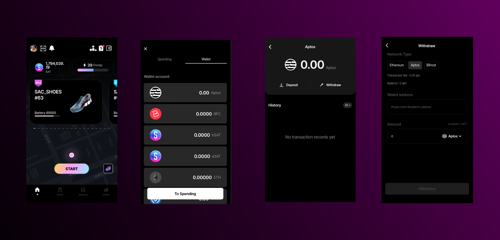

# **SAC Wallet With Aptos**

> In the wallet (transaction) code,  
code that references the database will use the
for security reasons.
Used libraries.

- [Moralis](#moralis)
- [Aptos](#aptos)
- [Bip39](#bip39)

# Apps
###  Google Play : <a href="https://play.google.com/store/apps/details?id=com.exclusivelabs.sacapp">SAC : Sports Metaverse
</a>

###  App Store : <a href="https://apps.apple.com/kr/app/sac-sports-metaverse/id6443518245">SAC : Sports Metaverse
</a>

# Code 

- SAC_crypto : Using Aptos(blockchain) code, create the necessary **functions**.
- SAC_wallet : Demonstrate **how we used the blockchain functions**.